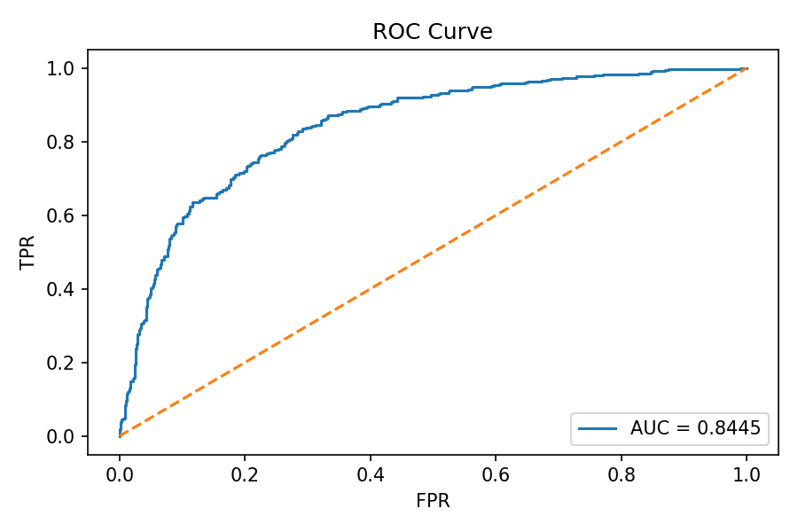
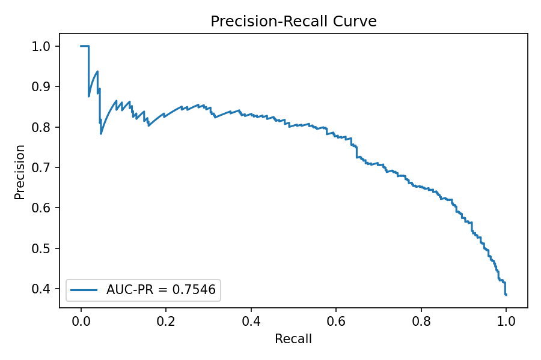
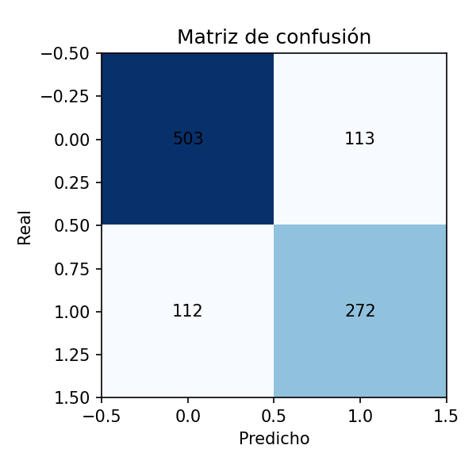

# Evaluation report

*Generado:* 2025-11-14 19:11:39Z

## Resumen ejecutivo

- **Accuracy:** 0.775
- **Precision:** 0.7064935064935065
- **Recall:** 0.7083333333333334
- **F1:** 0.7074122236671001
- **ROC AUC:** 0.8444982751623377

## Impacto de negocio (estimado)

- TP: 272, TN: 503, FP: 113, FN: 112
- Net en dataset: 13090.0
- Estimación mensual (escalada): 130900.0
- Estimación anual (escalada): 1570800.0

## Curvas y Matrices

### ROC Curve



### Precision-Recall Curve



### Matriz de confusión



## Importancia de features

Top features (csv y gráfico están incluidos):

| index                          |         0 |
|:-------------------------------|----------:|
| num__ratio_agotados_inventario | 0.274465  |
| num__nivel_inventario_general  | 0.124503  |
| num__productos_agotados        | 0.0696332 |
| num__tiempo_carga_sitio        | 0.0592522 |
| num__temperatura               | 0.0506911 |
| num__valor_promedio_item       | 0.049107  |
| num__valor_carrito             | 0.0405584 |
| num__ticket_promedio_historico | 0.036534  |
| num__dia_mes                   | 0.0356536 |
| num__hora_pedido               | 0.0342871 |


## SHAP (si se generó)

- No se generó SHAP o no se encontró `shap_beeswarm.png`.

## CV Scores (por fold)

```

{
  "cv_scores": [
    0.7071977638015374,
    0.6935598018400566,
    0.7034965034965035,
    0.6732255797610681,
    0.6781609195402298
  ]
}

```

## Archivos generados

- business_impact.json
- cases_FN.csv
- cases_FP.csv
- cases_TN.csv
- cases_TP.csv
- confusion_matrix.png
- cv_scores.json
- metrics.json
- pr_curve.png
- roc_curve.png
- test_with_preds.csv
